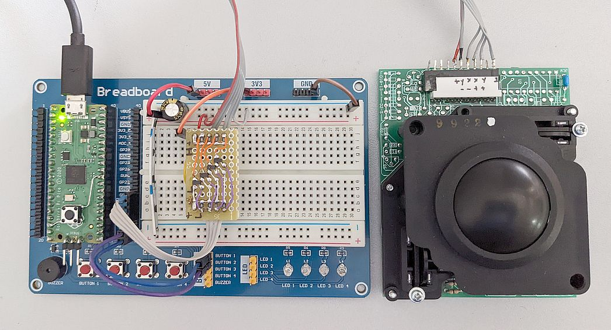
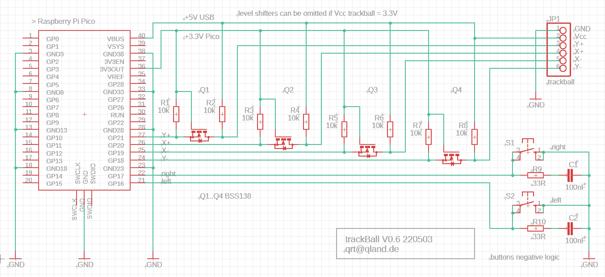

# **trackBall**

### A Trackball connected to PC with RP2040 Pico
via USB as HID-Device without need of extra drivers = Plug and Play

<br>



<br>

[-> views](#views)  
[-> source](source)

<br>

## Preparation
Adafruit TinyUSB Library does not work with arduino standard board manager so you have to set up a working one
```
arduino IDE
File/Preferences/Additional Board Manager URLs
https://github.com/earlephilhower/arduino-pico/releases/download/global/package_rp2040_index.json

vscode arduino (or arduino IDE)
library manager   -> Adafruit TinyUSB Library
board manager     -> Raspberry Pi Pico/ RP2040 by Earle F. Philhower
board config      -> Raspberry Pi Pico (Raspberry Pi Pico/RP2040)      
                     USB Stack -> Adafruit TinyUSB

if necessary, rebuild intellisense configuration to update c_cpp_properties.json (CTRL+ALT+I)
(vscode/file/preferences/settings/arduino/disable intelli sense auto gen -> must be UNCHECKED)

if #include "Adafruit_TinyUSB.h" is squiggled, add to workspace settings.json
"C_Cpp.intelliSenseEngine": "Tag Parser"

arduino.json should look like this
"sketch": "trackBall_ard.ino",
"board": "rp2040:rp2040:rpipico",
"output": "../_build_arduino",
"port": "COM4",
"configuration": "flash=2097152_0,freq=133,opt=Small,rtti=Disabled,dbgport=Disabled,dbglvl=None,usbstack=tinyusb"

```

## Configuration
Button logic, timing, debounce   
-> button.h

Encoder timing, debounce, mechanical, optical, single, dual or quadruple step, XY-swap, X and Y direction swap  
-> encoder.h

<br>

## Schematic
Level shifters can be omitted if Vcc trackball = 3.3V  


<br>

## Links
https://github.com/adafruit/Adafruit_TinyUSB_Arduino  
https://github.com/earlephilhower/arduino-pico

<br>

---

<br>

## Views


<br>
<br>

---

[qrt@qland.de](mailto:qrt@qland.de) 220503
